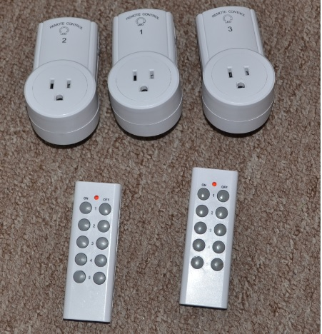

# Wireless Transmit Manager for PI

This project receives messages from an mqtt broker and then
sends them wirelessly on a raspberry pi. It allows additional
devices to be easily integrated.

## Transmitter

The transmitter I used is a BX-TM01-433:

It works well from the basement to the second floor in my house and is 
available on ebay for about $3 Canadian: [BX-TM01-433](http://www.ebay.ca/itm/Very-Small-ASK-RF-Wireless-Transmitter-board-module-433MHZ-10mA-75KHZ-3kbs-/280909343896?hash=item4167806c98). While this one
works well for me, any other 433 transmitter should work with this project as well.

## To build:
TODO

## Currently supported devices

* Lacross 141 temperator sensor
* Generic 2272 device 

### Lacross 141

The Lacross 141 is available at Canadian tire and often goes on sale for $10-$15.  In this case it is the display that is supported and you can use this project to register a display and then send temperator value to the display.  For example you could have a remote site publish a temperator and then have it displayed on a local display.  [cnd tire link](http://www.canadiantire.ca/en/pdp/la-crosse-weather-station-with-colour-frame-1427129p.html#.VV6MmlKznt8) 

### Generic 2272 devices

#### 120V switch
This is support for the switch part of the set.  The best way to get the codes you need to send is to use the PI433WirelessRecvManager project to, watch the appropriate topics and then push the buttons on the remote which will give you the codes that need to be sent to for that button.

Device: - 2272 - parameters(<your topic>, 200)
Available from eay.
[ebay link 120v switch](http://www.ebay.ca/itm/381117176383?_trksid=p2060353.m2749.l2649&ssPageName=STRK%3AMEBIDX%3AIT)

#### Custom
The following circuit is a custom receiver I built which can receive a command to turn on/off the 12v supply:

## Adding a new device
TODO

## TODOs
- add more info about build dependencies
- add more comments to the code
- add more general documenation
- add more info about how to figure out protocol for a new device
- add info on topics used to receive messages for each device
- make topics more easily configurable
